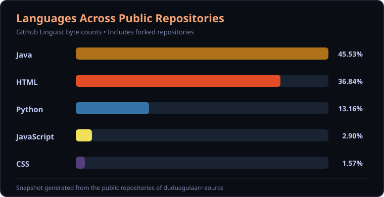
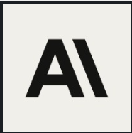

  

  
  

<table align="center">
  <tr>
    <td align="center">
      
    </td>
    <td align="center">
      
    </td>
    <td align="center">
      
    </td>
  </tr>
</table>

## GitHub Statistics

  

  

<table align="center">
  <tr>
    <td width="50%" align="center">
      
    </td>
    <td width="50%" align="center">
      
    </td>
  </tr>
</table>

## About Me

- My name is **Eduardo de Oliveira Aguiar**.
- I am pursuing a **Bachelor's degree in Software Engineering** at the Federal University of Technology – Paraná (**UTFPR**), Cornélio Procópio Campus, from October 2024 to July 2028.
- I am based in **Paraná, Brazil**.
- I am currently seeking my **first internship opportunity in IT**.
- I have built hands-on experience through real projects involving backend development, product ownership, requirements engineering, and frontend development with social impact.

<em>“Curiosity that creates solutions”</em>

## Certifications

<table align="center">
  <tr>
    <td width="33%" align="center" valign="top">
       
      <strong>Claude 101</strong> 
      Anthropic
    </td>
    <td width="33%" align="center" valign="top">
       
      <strong>The Future of Work with Generative AI</strong>
    </td>
    <td width="33%" align="center" valign="top">
       
      <strong>AI and Creativity: Innovate or Fall Behind?</strong>
    </td>
  </tr>
</table>

<table align="center">
  <tr>
    <td width="50%" align="center" valign="top">
       
      <strong>Enterprise Performance Management Systems</strong>
    </td>
    <td width="50%" align="center" valign="top">
       
      <strong>Intermediate Excel</strong>
    </td>
  </tr>
</table>

## Experience & Projects

| Name | Description | Stack |
|:---|:---|:---|
| **EcoPrioridade** | Developed during **HackaBee 6.0**, a 48-hour hackathon. I worked as **Product Owner** on a predictive urban maintenance platform that applies Machine Learning to public management and supports **SDG 9**. | Product Ownership · Machine Learning |
| **EducaDoa** | Web platform for donating school supplies to the community of Cornélio Procópio. | JavaScript · DOM Manipulation · LocalStorage |
| **ColabUTFPR** | Software requirements elicitation and modeling based on real interviews, UML diagrams, and a navigable prototype. | Requirements Engineering · UML · Prototyping |
| **Pharmacy Management System** | Built from scratch in Java using object-oriented architecture and no frameworks. | Java · Object-Oriented Programming |

## Technologies

<table align="center">
  <tr>
    <td align="center" width="25%">
       
      <b>Python</b>
    </td>
    <td align="center" width="25%">
       
      <b>Java</b>
    </td>
    <td align="center" width="25%">
       
      <b>Spring Boot</b>
    </td>
    <td align="center" width="25%">
       
      <b>HTML5</b>
    </td>
  </tr>
  <tr>
    <td align="center" width="25%">
       
      <b>CSS3</b>
    </td>
    <td align="center" width="25%">
       
      <b>JavaScript</b>
    </td>
    <td align="center" width="25%">
       
      <b>n8n</b>
    </td>
    <td align="center" width="25%">
       
      <b>Git</b>
    </td>
  </tr>
  <tr>
    <td align="center" width="25%">
       
      <b>Claude AI</b>
    </td>
    <td align="center" width="25%">
       
      <b>Excel</b>
    </td>
    <td align="center" width="25%">
       
      <b>C</b>
    </td>
    <td align="center" width="25%">
       
      <b>MySQL</b>
    </td>
  </tr>
  <tr>
    <td align="center" width="25%">
       
      <b>R</b>
    </td>
    <td align="center" width="25%">
       
      <b>GitHub</b>
    </td>
    <td align="center" width="25%"></td>
    <td align="center" width="25%"></td>
  </tr>
</table>

  

